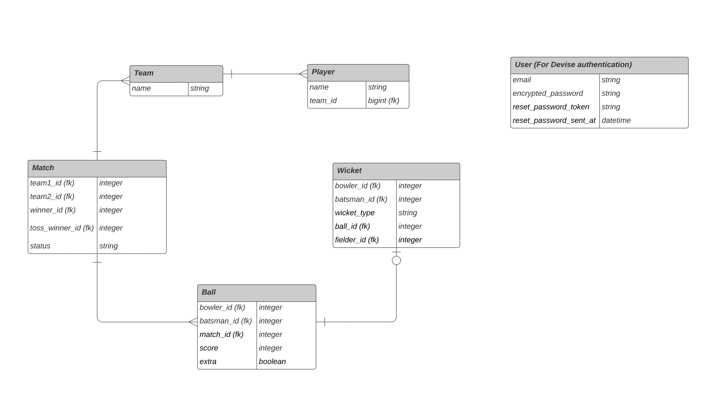

## Notes
This application is for recording cricket match scores.
The Application is built using Ruby On Rails 6, ruby 3.0.1

### Date
November 7, 2021

### Location of deployed application
https://cricket-score-recorder.herokuapp.com
The application is API only, so there ain't any homepage there.

### Time spent
6 hrs

### Assumptions made
1. team winning the toss always will bat first.
2. there are max of 20 overs per team (configurable as a constant in match model)
3. match status updates (eg. toss, scheduling, completion etc) are supposed to be handled via specific API calls. No assumption on wickets falling or ball throws are made in codebase.
4. We are using user auth just for authentication, and are not maintaining the same in database transactions.

### Shortcuts/Compromises made
1. skipped some nitty gritty validations

### Instructions to run assignment locally
1. clone the repo
2. Confirm db config in config/database.yml
3. Add `.env` file in your root folder. There's a sample `.env.example` file.
3. Do a `bundle install`
4. Seed some data in DB using `bundle exec rake db:create db:migrate db:seed`
5. Play along with the [postman collection](https://www.getpostman.com/collections/92f716c4fa7fd631d7e1)
6. Postman script is configured to update auth token `{{token}}` automatically on user signup and login.
7. Run `bundle exec rspec` to run the test suite, and update `swagger` docs.
8. Swagger documentation could be accessed at `http://localhost:3000/api-docs`

### What did you not include in your solution that you want us to know about
1. Stretch goals
2. Swagger documentation is accessible only on localhost, and not on the herokuapp, it was causing certain problems with the deployment.

### Plans for improvements
1. Add proper validations.
2. Better scoreboard.

### Other information about your submission that you feel is important for us to know.
I've maintained swagger documentation for all APIs, which could be accessed at `/api-docs`

### Your feedback on this technical challenge
The technical challenge was all in all a brilliant one, and managed to challenge me on various fronts.
To be frank, I had never thought designing a system for recording cricket scores might prove this tricky, and
this is a starter at the very best. I hope I have been able to showcase my testing, documentation and system design skills properly.
It required me to think in terms of how I could design an MVP, and think with that approach.
